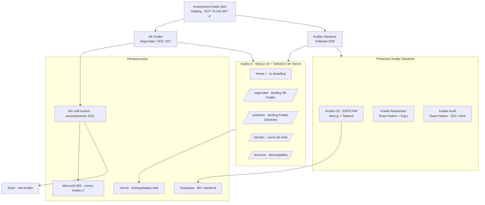

# MIGRACIÓN — PROYECTO "PÁGINA WEB KRAIBE" → CLAUDE TEAM
**Base de conocimiento autosuficiente · Inversiones Kraibe SpA**

> **Propósito de este documento:** que cualquier persona o agente nuevo entienda el proyecto completo, continúe el desarrollo y tome decisiones sin contexto previo. Es exhaustivo a propósito: es una migración, no un resumen.
>
> **Última consolidación:** 10 de junio de 2026
> **Mantenedor / autoridad única:** Gabriel Kraemer · gkraemer@kraibe.cl
> **Convención de marcas:** `[CONFIRMAR]` = dato ambiguo o en conflicto que Gabriel debe validar. La sección 9 lista todo lo que no se pudo determinar.

---

## ÍNDICE

1. [Resumen ejecutivo](#1-resumen-ejecutivo)
2. [Arquitectura y stack](#2-arquitectura-y-stack)
3. [Base de conocimiento adjunta](#3-base-de-conocimiento-adjunta)
4. [Historial de desarrollo](#4-historial-de-desarrollo)
5. [Código y estructura](#5-código-y-estructura)
6. [Estado actual y próximos pasos](#6-estado-actual-y-próximos-pasos)
7. [Instrucciones para Claude Team](#7-instrucciones-para-claude-team)
8. [Contexto de negocio](#8-contexto-de-negocio)
9. [Información faltante / pendiente de confirmar](#9-información-faltante--pendiente-de-confirmar)

---

## 1. RESUMEN EJECUTIVO

### Qué es el proyecto
Rediseño e implementación del sitio web corporativo **kraibe.cl** más el sistema de marca (design system) que lo sustenta. El sitio es la vitrina pública de **Inversiones Kraibe SpA**, un holding tecnológico chileno con dos unidades operativas:

- **SE Kraibe** — Seguridad electrónica profesional con SOC (Security Operations Center) de monitoreo 24/7, control de acceso y conserjería remota. Certificación Ley 21.659 / OS-10.
- **Kraibe Solutions** — Plataforma propietaria de software ERP/CRM llamada **Kraibe OS**, además de apps móviles (Kraibe Residentes, Kraibe Audit).

### Para quién y qué problema resuelve
El sitio anterior tenía **dos problemas críticos de credibilidad**: estética genérica de "empresa de cámaras" y logos de cliente de relleno (placeholders). Ambos minaban la identidad tech que Kraibe necesita para vender software B2B y servicios recurrentes de alto valor. El objetivo es **posicionar a Kraibe como firma tecnológica creíble** (no una empresa de seguridad genérica), apoyándose en métricas reales y casos de cliente nombrados.

Audiencia: condominios, empresas y PYMES en Chile que contratan seguridad operacional y/o software de gestión.

### Estado actual (al 10-jun-2026)
- **Marca / design system: ~70% listo.** Paleta, tipografía, tokens, logos, firma de email, plantilla PPTX y fundaciones del DS están cerrados. Falta orquestación final.
- **Sitio kraibe.cl: en desarrollo.** Existe un rediseño completo en HTML de página única (entregado como artifact) y **8 componentes de marketing en React/Next.js** ("Bloque B") listos para integrar. **Blocker principal:** portar el diseño HTML al codebase Next.js existente. El codebase de producción **no está incluido** en esta carpeta de proyecto (ver sección 9).
- **Automatización SOC (n8n): parcial.** 2 workflows importados; bloqueados por credenciales OAuth pendientes (ver sección 4).
- **Sprint actual (estimado):** Semana 3–4 del plan de 4 semanas del Resumen Ejecutivo (2–15 junio): styling de Kraibe OS + landings `/seguridad` y `/solutions`. `[CONFIRMAR]` el sprint exacto vigente.

### Stack tecnológico (resumen — detalle exacto en §2)
Next.js 16 (App Router, React Server Components por defecto) · React 19 · TypeScript 5+ · Tailwind CSS 4 · Radix UI · lucide-react · class-variance-authority. Mobile: React Native + Expo + NativeWind. Infra: Vercel (deploy) + Supabase (BD/backend) + Microsoft 365 (correo/dominio). Automatización: n8n self-hosted.

> ⚠️ Las versiones de Next.js 16 / React 19 / Tailwind 4 provienen de los docs de los componentes. `[CONFIRMAR]` contra el `package.json` real del codebase de producción.

---

## 2. ARQUITECTURA Y STACK

### 2.1 Stack canónico (con versiones declaradas)

| Capa | Tecnología | Versión declarada | Notas |
|---|---|---|---|
| Framework web | **Next.js** | 16 (App Router) | RSC por defecto; `'use client'` solo donde hay estado/interacción |
| UI runtime | **React** | 19 (implícito por Next 16) | `[CONFIRMAR]` versión exacta |
| Lenguaje | **TypeScript** | 5+ | |
| Estilos | **Tailwind CSS** | 4 | Tokens semánticos (`bg-brand`, `bg-foreground`, `bg-muted`, etc.) |
| Primitivas accesibles | **Radix UI** | `@radix-ui/react-accordion` | Única dep nueva del Bloque B |
| Iconos | **lucide-react** | — | Todos los iconos del DS |
| Variantes de clase | **class-variance-authority (cva)** | — | Patrón estándar de todos los componentes |
| Utilidades clase | **clsx** + **tailwind-merge** | — | Expuestas vía `cn()` en `@/lib/utils` |
| Mobile | **React Native + Expo + NativeWind** | — | Kraibe Residentes, Kraibe Audit (Reanimated v3 para bottom sheets) |
| Gestor de paquetes | **pnpm** | — | `pnpm add ...` en toda la documentación |

### 2.2 Diagrama de arquitectura



### 2.3 MCPs / conectores configurados (en este entorno) y su propósito

| Conector | Propósito en el proyecto |
|---|---|
| **Vercel** | Deploy y hosting de kraibe.cl; logs de build y runtime; gestión de proyecto/dominios |
| **Supabase** | Base de datos / backend de Kraibe OS y formularios del sitio; migraciones, edge functions, tipos TS |
| **Microsoft 365 (Outlook / SharePoint)** | Correo corporativo `@kraibe.cl`, calendario, archivos. El dominio corre en M365 (no Gmail) |
| **Gmail** | Cuenta personal de Gabriel (`gabriel.kraemer.c@gmail.com`) — **no** usar para correo corporativo |
| **Slack** | Canal operativo `#se-kraibe` para alertas SOC y comunicación interna |
| **Google Drive** | Repositorio de assets de marca (logos, plantillas, kit IG) |
| **Canva** | Diseño de posts Instagram y piezas gráficas según el kit de marca |
| **DocuSign** | Firma de propuestas/contratos comerciales |
| **Google Calendar** | Agenda y coordinación de reuniones |
| **Claude in Chrome** | Operación de navegador para tareas que requieren UI (n8n, consolas OAuth) |

> Plugins instalados en el entorno: paquetes de Design, Finance, HR, Legal y Marketing (con sus conectores: Asana, Linear, Notion, HubSpot, Figma, Atlassian, Box, etc.). No todos son centrales al proyecto web; documentados aquí por completitud.

### 2.4 Variables de entorno requeridas (solo nombres — nunca valores)

> El codebase de producción no está en esta carpeta, así que esta lista es la **esperada** según el stack. `[CONFIRMAR]` contra `.env.example` real.

```
# Supabase
NEXT_PUBLIC_SUPABASE_URL
NEXT_PUBLIC_SUPABASE_ANON_KEY        # publishable key
SUPABASE_SERVICE_ROLE_KEY           # solo server-side / edge functions

# Sitio
NEXT_PUBLIC_SITE_URL

# Correo transaccional (formularios de contacto / cotización)
# Ruta decidida: Microsoft 365 OAuth (Azure AD) — ver §4. Alternativa evaluada: Resend.
SMTP_HOST / SMTP_PORT / SMTP_USER / SMTP_PASSWORD   # si se usa SMTP M365
# o
AZURE_CLIENT_ID / AZURE_CLIENT_SECRET / AZURE_TENANT_ID  # si OAuth Mail.Send
# o
RESEND_API_KEY                       # si se opta por Resend

# Automatización n8n
N8N_WEBHOOK_URL                      # http://localhost:5678/webhook/alertas-soc (dev)
SLACK_WEBHOOK_URL                    # Incoming Webhook a #se-kraibe

# Analytics (si se integra) [CONFIRMAR]
NEXT_PUBLIC_ANALYTICS_ID
```

### 2.5 Servicios externos conectados

- **Vercel** — deploy del sitio (CD desde repositorio). `[CONFIRMAR]` nombre del proyecto/equipo y dominio asignado.
- **Supabase** — proyecto de base de datos. `[CONFIRMAR]` project ref/región. **Pendiente de seguridad:** rotar password de Supabase (mencionado en sesión previa).
- **Microsoft 365** — tenant que aloja `kraibe.cl`; buzones `gkraemer@kraibe.cl` y (a crear) `soc@kraibe.cl`.
- **Slack** — workspace Kraibe, canal `#se-kraibe`.
- **n8n self-hosted** — `http://localhost:5678` (entorno local/servidor interno). `[CONFIRMAR]` si hay URL de producción.

---

## 3. BASE DE CONOCIMIENTO ADJUNTA

Contenido extraído y estructurado de los archivos del proyecto (carpeta `docs/`). Marcado explícito de qué es **decisión inamovible** vs. **puede cambiar**.

### 3.1 Reglas de negocio

| Regla | Tipo |
|---|---|
| Kraibe es un **holding con 2 unidades**: SE Kraibe (seguridad) + Kraibe Solutions (software). kraibe.cl representa al holding completo. | 🔒 Inamovible |
| **Instagram @sekraibe = SOLO SE Kraibe** (no el holding ni Solutions). | 🔒 Inamovible |
| Toda decisión de marca pasa por **aprobación única de Gabriel Kraemer**. Nadie edita logos sin autorización. | 🔒 Inamovible |
| Las propuestas comerciales **siempre** mencionan Ley 21.659 e incluyen números (99.9% disponibilidad, <60s respuesta, % de ahorro). | 🔒 Inamovible |
| Casos de cliente reales son el diferenciador de mayor valor → se priorizan en diseño sobre features de producto. | 🔒 Inamovible |
| Respuesta a incidentes **<60s** (y se documenta). | 🔒 Inamovible (promesa de servicio) |
| Pricing SE Kraibe en **UF** (ej. plan Básico "9 UF/mes + instalación · contrato 24 meses"). Solo **1 plan destacado** por grilla. | 🟡 Puede cambiar (montos/planes) |
| Estructura de propuesta: portada → situación actual vs propuesta → servicios → precios/ROI → cronograma → cierre. | 🟡 Puede cambiar |

### 3.2 Clientes reales con casos de éxito verificados

| Cliente | Servicio | Resultado documentado |
|---|---|---|
| **Rozto** | ERP/software + seguridad con IA | Visibilidad total de costo por producto, habilitando desarrollo de nuevos productos |
| **Footline** | Dashboard EERR multi-centro de kinesiología | Reemplazó flujos en Excel; decisiones en tiempo real |
| **Condominio Vía del Río Villuco** | Conserjería remota + monitoreo | Reducción significativa de costo de conserjería |

> Estos tres son los únicos casos confirmados para uso público. No inventar métricas ni clientes adicionales.

### 3.3 Decisiones técnicas (del DS y los componentes)

- **RSC por defecto** (SEO, performance, bundle size, streaming). Excepción: `FaqAccordion` es Client por estado de expansión. 🔒
- **CTAs interactivas** dentro de RSC se pasan como `actions: ReactNode`; si requieren analytics/modales, se envuelven en un Client Component (`TrackCta`). 🔒 (patrón)
- **Pricing: máximo 1 plan `highlighted`** por grilla (la badge lime "Recomendado" tiene el mayor peso visual del DS). 🔒
- **Dark mode** basado en navy, automático vía `prefers-color-scheme` / `data-theme="dark"`. 🔒
- **Footer** refleja estructura holding: matriz implícita en copyright + sister brands co-displayed (SE Kraibe izquierda, Kraibe Solutions derecha). 🔒
- **PPTX:** fuentes Trebuchet MS (títulos) + Calibri (cuerpo) — distinto de la web (Manrope), por compatibilidad Office. 🟡

### 3.4 Configuraciones de marca (design tokens)

**Paleta primaria (NO negociable):**

| Nombre | HEX | Uso |
|---|---|---|
| Teal Kraibe | `#33AEB3` | Acento principal, CTAs, isotipo |
| Navy Kraibe | `#0D364A` | Texto, dark mode base, headers |
| Lime Highlight | `#CFEE9E` | Callouts puntuales (máx 1 por sección/slide) |

**Variaciones:** Teal-Deep `#1A6F73` (links sobre blanco / texto accesible), Teal-300 `#7FCED1` (dark mode), Navy-700 `#1F4D63`, Navy-500 `#476A7D`, Lime-on-Dark `#E8F9C8`.
**Neutros (sesgo cálido):** neutral-50 `#FAF8F6`, neutral-200 `#E4DFDC`, neutral-600 `#5B544F`, neutral-900 `#1A1815`.
**Semánticos:** Success `#1F7A53`, Warning `#9C6B14`, Error `#A8412E`, Info `#2A5E7E`. Todos pasan WCAG AA (4.5:1). 🔒

**Tipografía:** Manrope (display/cuerpo, pesos 400/500/600/700/800 — sin intermedios) + JetBrains Mono (código/mono). Escala: Display-2XL 45px / Display-XL 37.5px / Display-LG 30px / H1 22.5px / H2 18.75px / H3 15px / H4 12.5px / Body 16px / Body-SM 14px / Caption 12px / Overline 11px. 🔒

**Logos:** 6 variantes (Logo Primary SE Kraibe, Mono Light, Isotipo, Logo Kraibe Solutions, Isotipo Solutions, Wordmark "KRAIBE"). Clear space = altura ÷ 2. Tamaños mínimos: Primary 120px web / 25mm print; Isotipo 24px / 8mm; Wordmark 80px. 🔒

### 3.5 Restricciones (Do's & Don'ts)

**NO HACER:** inventar/cambiar HEX; mezclar Manrope con otras sans; abusar de lime; navy+teal sin contraste (WCAG fail); tone pomposo ("soluciones integrales", "transformación digital", "ecosistema", "sinergia", "disruptivo"); rojo decorativo (solo errores reales); bajar tipografía bajo mínimos; múltiples editores de logos.

**Tone of voice:** directo, profesional, sin relleno; habla de números. Ej. ✅ "Monitoreo 24/7 + control de acceso. 99.9% disponibilidad, <60s respuesta." ❌ "Soluciones integrales de seguridad electrónica."

### 3.6 Inventario de archivos del proyecto (`docs/`)

| Archivo | Contenido |
|---|---|
| `KRAIBE_BRAND_GUIDELINES_v1.0.md` | **Source of truth** de marca (misión/visión, tone, arquitectura, paleta, tipografía, logos, aplicación por superficie, tokens). |
| `00_RESUMEN_EJECUTIVO.md` | Estado de marca al 19-may-2026, plan de 4 semanas, impacto financiero, checklist de responsabilidades. |
| `CHEAT_SHEET.md` | Resumen imprimible de marca para la oficina. |
| `Kraibe_UI_Components_Specification.md` | Spec técnica de componentes UI (botones, inputs, cards, badges, tablas, nav, modales, toasts) con código React/RN. |
| `README-CL.md` | Documentación del **Bloque B** (8 componentes de marketing Next.js) + patrones de uso. |
| `Kraibe_Instagram_Kit_Completo.md` | Kit IG @sekraibe: bio, tipos de contenido, calendario, copy, hashtags. |
| `Kraibe_Propuesta_Template_Microsoft.md` | Plantilla de propuesta comercial (Word/Docs). |
| `README-Plantilla-PPTX.md` | Guía de la plantilla maestra PPTX (10 layouts). |
| `README.md` | Instrucciones de instalación de la firma de email SOC. |
| `firma-SEKraibe-SOC-base64.html` / `-urls.html` | Firma de email (versión embebida vs. hosteada). |
| `*.tsx` (8 archivos) | Código fuente de los 8 componentes de marketing (ver §5). |
| `preview.html` | Preview del rediseño. |
| `files/*.png/.jpg/.pdf/.gif` (≈20 archivos) | Assets: logos, mockups, propuestas PDF, previews. |

---

## 4. HISTORIAL DE DESARROLLO

### 4.1 Sprints / hitos completados

**Mayo 2026 — Fundaciones de marca (Ejecución 1 + Bloque A/B):**
- Cerrado el design system base: paleta, tipografía, tokens CSS/Tailwind, 6 logos, firma de email HTML, plantilla PPTX (10 layouts). Marca al ~70%.
- Entregados los **8 componentes de marketing** ("Bloque B") para kraibe.cl: HeroBlock, PricingGrid, FeatureGrid, FaqAccordion (Client), TestimonialCard, StatsRow, CtaBanner, FooterCorporate. Todos RSC salvo FaqAccordion.
- Entregables documentales: Brand Guidelines v1.0, Resumen Ejecutivo, Cheat Sheet, UI Components Spec, Kit Instagram, plantillas de propuesta (Word + PPTX).

**Mayo–Junio 2026 — Rediseño del sitio:**
- Producido un **rediseño completo de kraibe.cl en HTML de archivo único**: navbar fijo, hero oscuro con stats reales, ticker animado, tarjetas dual-brand (SE Kraibe + Kraibe Solutions), mockup de dashboard Kraibe OS con KPIs y tabla de monitoreo, mockup dual-phone de App Residentes con notificaciones, tarjetas de caso de cliente con métricas reales, grilla de servicios por unidad, footer con datos legales (RUT 78.249.497-K).
- Output guardado como `kraibe-website.html`.

**Junio 2026 — Automatización SOC (n8n):**
- Importados 2 workflows en n8n self-hosted: **"Alertas SOC → Email + Slack"** (4 nodos) y **"Reporte Diario SOC"** (4 nodos).
- Capturada webhook URL de producción: `http://localhost:5678/webhook/alertas-soc` (endpoint para el VMS).
- Workflow id de ejemplo: `E3AxcOrdt42pd95Q`.

### 4.2 Decisiones arquitecturales y por qué

- **RSC por defecto** en el sitio → SEO, FCP rápido, menos JS al cliente. (§3.3)
- **Correo corporativo vía Microsoft 365, NO Gmail.** El dominio `kraibe.cl` corre en M365; usar el Gmail personal de Gabriel para alertas corporativas se descartó por seguridad y escalabilidad.
- **Ruta de correo para automatización:** se decidió que la vía correcta/escalable es **Azure AD OAuth (Mail.Send)**, no App Passwords (M365 los bloquea por defecto desde 2022 y son deuda técnica). Resend.com quedó como alternativa rápida si se necesita.
- **Notificaciones SOC vía Slack Incoming Webhook** (sin OAuth) como camino mínimo para validar el pipeline end-to-end.

### 4.3 Problemas resueltos (para no repetirlos)

- **Credibilidad del sitio anterior:** estética genérica de seguridad + logos placeholder. Solución: identidad tech + casos de cliente reales con métricas.
- **Fricción OAuth en n8n:** Gmail OAuth self-hosted exige crear app en Google Cloud Console (~20 min + verificación de dominio). Se evitó pivotando a M365/Slack webhook.

### 4.4 Lo que se intentó y NO funcionó (igual de importante)

- ❌ **Gmail OAuth en n8n self-hosted** — requería Client ID/Secret vía Google Cloud Console; demasiada fricción. Descartado.
- ❌ **App Password de Microsoft 365** — bloqueado por defecto en tenants M365 modernos (Security Defaults). No disponible sin desactivar protección (no recomendable). Descartado.
- ❌ **Usar Gmail personal para alertas corporativas** — descartado por seguridad/escalabilidad.
- ⚠️ **Estado del pipeline SOC:** quedó **sin activar** — los nodos Email y Slack siguen sin credenciales. El email se posterga para resolver con Azure AD OAuth; Slack se valida con Incoming Webhook. Pendiente de completar por Gabriel (pasos en §6/§7).

---

## 5. CÓDIGO Y ESTRUCTURA

### 5.1 Estructura de directorios recomendada (sitio Next.js)

```
src/
├─ app/
│  ├─ (marketing)/              ← layout group para landings
│  │   ├─ layout.tsx            ← Header + FooterCorporate global (RSC)
│  │   ├─ page.tsx              ← Home: Hero + Features + Pricing + FAQ + CTA
│  │   ├─ seguridad/page.tsx    ← /seguridad (SE Kraibe)
│  │   └─ solutions/page.tsx    ← /solutions (Kraibe Solutions)
│  └─ globals.css
├─ components/
│  ├─ ui/                       ← universales (botones, inputs… Ejecución 2)
│  ├─ os/                       ← Bloque A (Kraibe OS)
│  └─ marketing/                ← Bloque B (este proyecto)
│     ├─ hero-block.tsx
│     ├─ pricing-grid.tsx
│     ├─ feature-grid.tsx
│     ├─ faq-accordion.tsx      ← 'use client'
│     ├─ testimonial-card.tsx
│     ├─ stats-row.tsx
│     ├─ cta-banner.tsx
│     └─ footer-corporate.tsx
└─ lib/
   └─ utils.ts                  ← exporta cn() (clsx + tailwind-merge)
```

> Esta es la estructura **objetivo** documentada en `README-CL.md`. El codebase de producción real **no está incluido** en esta carpeta; los `.tsx` viven en `docs/` como entregables. Ver §9.

### 5.2 Inventario de componentes (Bloque B)

| Componente | RSC | Variantes / notas |
|---|---|---|
| `HeroBlock` | ✅ | `centered` (home), `split` (landings), `banner` (anuncios); tones default/muted/dark/brand |
| `PricingGrid` | ✅ | Badge "Recomendado" lime; máx 1 plan `highlighted` |
| `FeatureGrid` | ✅ | Grilla de capacidades con iconos (iconTone brand/success/info/lime/warning/primary) |
| `FaqAccordion` | ❌ Client | Radix Accordion; `defaultOpen`; animaciones en `tailwind.config.ts` |
| `TestimonialCard` | ✅ | 3 variantes + `TestimonialGrid` |
| `StatsRow` | ✅ | `default` / `dark` / `brand` / `inline` |
| `CtaBanner` | ✅ | `default` / `dark` / `brand` (máx 1 principal) / `split` / `inline` |
| `FooterCorporate` | ✅ | Sister brands, secciones de links, redes, datos legales |

### 5.3 Convenciones de código

- Cada componente abre con un **bloque JSDoc** que explica propósito, si es RSC, variantes y casos de uso.
- **Variantes con `cva`** (`class-variance-authority`) + `VariantProps`; clases combinadas con **`cn()`** desde `@/lib/utils`.
- Imports de tipo con `import * as React from 'react'`; iconos desde `lucide-react` (incl. `type LucideIcon`).
- **Tokens semánticos de Tailwind** en vez de HEX crudos: `bg-brand`, `bg-foreground`, `text-background`, `bg-muted`, `brand-foreground`, etc. → el theming (incl. dark) vive en la config, no en los componentes.
- Props públicas tipadas vía `interface ...Props extends HTMLAttributes<...>, VariantProps<...>`.
- `'use client'` **solo** cuando hay estado/interacción (FaqAccordion, forms, TrackCta).
- Naming: archivos `kebab-case.tsx`; componentes `PascalCase`; carpetas por dominio (`ui/`, `os/`, `marketing/`).

### 5.4 Patrón recurrente — CTA interactiva en RSC

```tsx
// components/marketing/track-cta.tsx
'use client'
import { Button } from '@/components/ui/button'

export function TrackCta({ event, children, ...props }: any) {
  return (
    <Button {...props} onClick={() => { analytics.track(event); props.onClick?.() }}>
      {children}
    </Button>
  )
}
// uso en page.tsx (RSC):
<HeroBlock actions={<TrackCta event="hero_cta_clicked">Empezar</TrackCta>} />
```

### 5.5 Scripts de setup / deploy

```bash
# Dependencias (sobre las de Ejecuciones 1+2+A)
pnpm add @radix-ui/react-accordion
# (resto reutiliza lucide-react, class-variance-authority, clsx, tailwind-merge)

# Desarrollo
pnpm install
pnpm dev

# Build / producción
pnpm build
pnpm start

# Deploy: vía Vercel (CD automático desde el repositorio conectado)
```

**Animaciones del accordion** (añadir a `tailwind.config.ts`):

```ts
extend: {
  keyframes: {
    'accordion-down': { from: { height: '0' }, to: { height: 'var(--radix-accordion-content-height)' } },
    'accordion-up':   { from: { height: 'var(--radix-accordion-content-height)' }, to: { height: '0' } },
  },
  animation: {
    'accordion-down': 'accordion-down 240ms cubic-bezier(0.16, 1, 0.3, 1)',
    'accordion-up':   'accordion-up 180ms ease-out',
  },
}
```

> `[CONFIRMAR]` los scripts exactos contra el `package.json` real (test, lint, typecheck no están documentados — ver §9).

---

## 6. ESTADO ACTUAL Y PRÓXIMOS PASOS

### 6.1 Features completas (con evidencia)

| Feature | Evidencia |
|---|---|
| Design system base (paleta, tipografía, tokens) | `KRAIBE_BRAND_GUIDELINES_v1.0.md`, tokens CSS/Tailwind exportados |
| 6 logos finales | `files/` (PNG) + inventario en guidelines |
| 8 componentes de marketing | `docs/*.tsx` + `README-CL.md` |
| Firma de email SOC | `firma-SEKraibe-SOC-base64.html` + README |
| Plantilla PPTX (10 layouts) | `README-Plantilla-PPTX.md` |
| Rediseño HTML de kraibe.cl | `kraibe-website.html` (artifact), `preview.html` |
| 2 workflows n8n importados | webhook prod capturada; workflow `E3AxcOrdt42pd95Q` |

### 6.2 En progreso

| Feature | % aprox | Qué falta |
|---|---|---|
| Sitio kraibe.cl en Next.js | ~40% `[CONFIRMAR]` | Portar el HTML al codebase; integrar los 8 componentes; navbar marketing (mobile menu); páginas `/seguridad`, `/solutions`, `/clientes`, `/recursos` |
| Styling de Kraibe OS | ~30% `[CONFIRMAR]` | Aplicar DS a componentes del ERP; dark mode; QA visual |
| Automatización SOC n8n | ~60% | OAuth Azure AD (email) + Slack webhook; activar workflow; test end-to-end |
| Instagram @sekraibe | inicial | Publicar primeros posts según calendario |

### 6.3 Backlog priorizado

1. **Portar diseño HTML → Next.js** e integrar Bloque B (blocker del lanzamiento web).
2. **Reemplazar mockups por screenshots reales** de Kraibe OS y App Residentes (los entrega Gabriel).
3. **Navbar marketing** (Client Component con menú mobile).
4. **Demo/cotización request form** (Client Component con validación Zod + react-hook-form → Supabase / correo).
5. **Cookie banner** (consentimiento legal).
6. Completar y activar pipeline SOC (Azure AD OAuth + Slack).
7. Páginas legales: `/privacidad`, `/terminos`, `/cookies`.
8. Restyling completo de Kraibe OS.
9. Bloque C (mobile): TabBar, AppHeader, BottomSheet (Reanimated v3), etc.
10. Fotos de oficina (diferidas unos meses).

### 6.4 Deuda técnica identificada

- **App Passwords** como vía de correo = deuda técnica; migrar a Azure AD OAuth.
- **Mockups** en lugar de screenshots reales en el sitio.
- **n8n en `localhost`** — falta endpoint de producción real / hosting estable.
- **Secretos pendientes de rotar:** password de Supabase y `ABACUSAI_API_KEY` (mencionados en consolidación previa de proyectos).
- Componentes `TrackCta` tipados como `any` → tipar correctamente.
- `RUT` placeholder (`77.XXX.XXX-X`) en el ejemplo del footer vs. RUT real `78.249.497-K` → corregir en código.

---

## 7. INSTRUCCIONES PARA CLAUDE TEAM

### 7.1 Cómo retomar el proyecto desde cero

1. Lee `KRAIBE_BRAND_GUIDELINES_v1.0.md` (source of truth de marca) y `README-CL.md` (componentes).
2. Localiza el **codebase Next.js de producción de kraibe.cl** (no está en esta carpeta — pídeselo a Gabriel o clónalo del repo; ver §9).
3. Confirma versiones reales en `package.json` y variables en `.env.example`.
4. Revisa los 8 componentes en `docs/*.tsx` y la estructura objetivo (§5.1).

### 7.2 Comandos de setup

```bash
pnpm install
pnpm add @radix-ui/react-accordion   # si aún no está
cp .env.example .env.local            # y completar valores (§2.4)
pnpm dev                              # http://localhost:3000
```

### 7.3 Cómo correr tests

`[CONFIRMAR]` — no hay framework de tests documentado. Verificar en `package.json` (`pnpm test` / `pnpm lint` / `pnpm typecheck`). Recomendado mínimo antes de PR: `pnpm lint && pnpm build`.

### 7.4 Cómo hacer deploy

Deploy vía **Vercel** (CD automático desde el repo conectado). Push a la rama de producción → Vercel build & deploy. Usar el conector Vercel para revisar `get_deployment_build_logs` y `get_runtime_logs` ante fallos. `[CONFIRMAR]` nombre de proyecto y rama de producción.

### 7.5 Qué NO tocar y por qué

- **HEX de la paleta y la tipografía** — son inamovibles y pasan WCAG AA. No inventar colores ni mezclar fuentes.
- **Logos** — no editar ni recrear sin aprobación de Gabriel.
- **Arquitectura de marca** (holding + 2 unidades; IG solo SE Kraibe) — no reinterpretar.
- **Casos de cliente / métricas** — usar solo los 3 verificados; no inventar números.
- **RSC por defecto** — no convertir componentes a Client salvo necesidad real de estado.
- **Correo corporativo** — siempre M365 (`@kraibe.cl`), nunca el Gmail personal.
- **Secretos** — nunca exponer en `.md`, código ni chat; usar gestor (Bitwarden/1Password) y variables de entorno.

### 7.6 Completar el pipeline SOC (pendiente)

1. Crear buzón `soc@kraibe.cl` en M365 (admin.microsoft.com).
2. Email: registrar app en Azure AD (entra.microsoft.com) con permiso `Mail.Send` → usar nodo Microsoft Outlook (OAuth2) en n8n.
3. Slack: crear Incoming Webhook a `#se-kraibe` (api.slack.com/apps) → nodo HTTP Request en n8n.
4. Activar workflow (toggle Inactive→Active, Ctrl+S) y testear con `curl -Method POST .../webhook/alertas-soc`.

---

## 8. CONTEXTO DE NEGOCIO

### 8.1 Empresa / unidad
**Inversiones Kraibe SpA** — holding tecnológico chileno. RUT **78.249.497-K**. Concepción, Biobío, Chile.
- **SE Kraibe:** seguridad electrónica + SOC 24/7 + control de acceso + conserjería remota. Certificación Ley 21.659 / OS-10. Instagram @sekraibe.
- **Kraibe Solutions:** software B2B — Kraibe OS (ERP/CRM), Kraibe Residentes (app residentes), Kraibe Audit (app SOC operadores). Presencia en LinkedIn.

**Misión:** proteger lo que tiene valor para los clientes vía monitoreo 24/7 accesible y confiable, con certificaciones que garantizan continuidad operativa.
**Visión:** ser el SOC integrado para conserjería de referencia en Chile.
**Valores:** rapidez (<60s), transparencia, eficiencia (ahorro operacional), profesionalismo (certificaciones/protocolos).

### 8.2 Contacto y datos legales

| Campo | Valor |
|---|---|
| Razón social | Inversiones Kraibe SpA |
| RUT | 78.249.497-K |
| Contacto principal | Gabriel Kraemer · gkraemer@kraibe.cl · +56 9 5171 5595 |
| Correo SOC | soc@kraibe.cl *(a crear)* |
| Dominio / correo | kraibe.cl (Microsoft 365) |
| Dirección | `[CONFIRMAR]` — aparecen 3 distintas en los docs (ver §9) |

### 8.3 Stack de herramientas operativas (MCP / integraciones activas)
Vercel, Supabase, Microsoft 365 (Outlook/SharePoint), Slack (`#se-kraibe`), Google Drive, Canva, DocuSign, Google Calendar, Claude in Chrome, n8n self-hosted. (Detalle de propósito en §2.3.)

### 8.4 Restricciones no técnicas

- **Persona clave / dependencia:** Gabriel Kraemer es autoridad única de aprobación de marca y punto de decisión técnico-comercial. Riesgo de cuello de botella — un objetivo declarado del proyecto es **escalar de operación dependiente del fundador → sistema** (que el equipo pueda generar propuestas sin Gabriel).
- **Plazos:** plan de marca a 4 semanas (mayo–junio 2026); roadmap mes 2–4 para OS, Residentes/Audit, email templates.
- **Filosofía operativa de Gabriel:** respuestas directas y accionables; foco en ingresos, margen, escalabilidad y riesgo; automatización siempre que sea posible; valor (no precio) en lo comercial; precisión técnica.
- **Presupuesto / costos externos:** `[CONFIRMAR]` (no documentado). Se mencionan free tiers (Resend 3000/mes) como criterio de ahorro.

### 8.5 KPIs de negocio a seguir (mensual)

Propuestas con branding correcto (meta 100%), followers IG (+200/mes), leads IG (10–15/mes), tiempo por propuesta (<1h), retrabajos de diseño (0). Impacto esperado del sitio live: +30–50% inquiries/mes.

---

## 9. INFORMACIÓN FALTANTE / PENDIENTE DE CONFIRMAR

Lo que **no se pudo determinar** desde el material disponible y se necesita que Gabriel provea:

**Codebase / técnico**
1. **El codebase Next.js de producción de kraibe.cl no está en esta carpeta** — solo hay docs y los `.tsx` de componentes. Falta: repositorio (URL Git), `package.json` real, `.env.example`, `tailwind.config.ts`, `tokens.css`, `tokens.ts`, `lib/utils.ts`.
2. **Versiones exactas** de Next.js / React / Tailwind (declaradas como 16 / 19 / 4, sin confirmar contra `package.json`).
3. **Framework y comandos de test/lint/typecheck** — no documentados.
4. **Vercel:** nombre del proyecto, equipo, rama de producción, dominio asignado.
5. **Supabase:** project ref, región, esquema de BD, edge functions existentes.
6. **Lista real de variables de entorno** (la de §2.4 es inferida).

**Datos de negocio en conflicto**
7. **Dirección de la empresa — 3 versiones distintas** en los docs:
   - "O'Higgins 940, of. 1203, Concepción" (README-CL footer)
   - "Colo Colo 379, Of 706, Concepción" (plantilla de propuesta)
   - `[CONFIRMAR]` cuál es la vigente.
8. **RUT en el footer de ejemplo** usa placeholder `77.XXX.XXX-X`; el real es `78.249.497-K`. Confirmar y corregir en código.
9. **Sprint vigente exacto** y % real de avance del sitio y de Kraibe OS (estimados en este doc).

**Automatización / infraestructura**
10. **URL de producción de n8n** (hoy `localhost:5678`) y estado real del pipeline SOC (¿se activó Slack webhook?).
11. **Decisión final de correo transaccional:** Azure AD OAuth vs. Resend vs. SMTP.
12. **Secretos a rotar:** password Supabase y `ABACUSAI_API_KEY` — confirmar si ya se rotaron.

**Assets**
13. **Screenshots reales** de Kraibe OS y App Residentes (para reemplazar mockups).
14. Acceso a la carpeta "KRAIBE BRANDING" en Drive/Notion (tokens, Figma, plantillas originales).

---

*Documento de migración generado para importación a Claude Team. Fuente: base de conocimiento del proyecto "Pagina Web KRAIBE" (docs/, memory.md) e historial de sesiones de desarrollo. Inversiones Kraibe SpA · 10 de junio de 2026.*
